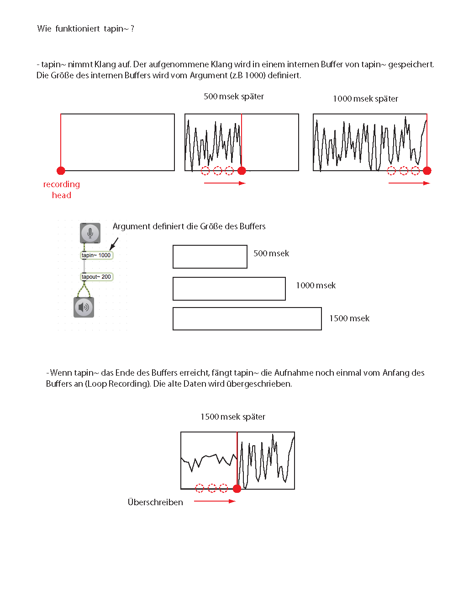
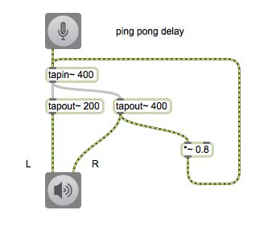

# K1: Delay

### Assignment 1

Implement delay effect (1000 ms) without using **tapin~**, **tapout~** or **delay~**. The use of **gen~** is also not allowed.

## Simple Delay

---

---

## Feedback Delay

### Assignment 2

- Feedback delay could be dangerous because it could generate indefinitely boosted sound. The looped boosted sound may explode the output. How can we avoid this situation?

- What's going to happen when the delay time is longer than the max delay time?

- Make the delaytime very short (3 msec or similar) and put the feedback ratio close to maximum e.g. 0.95. What kind of audio effect can you here?

## Pingpong Delay

### Assignment 3
In the example patch of pingpong delay we hear delays hard-left or hard-right. By using **pan2S~** Make those two panning locations flexible and let the user of you patch freely move those two locations.

---

## Multitap delay

### Assignment 4

Apples Audio Unit Plugin called "Delay Designer" allows us to control not only the timing, amplitude, or position, but also pan, HPF/LPF cut off in order users to manipulate the characteristics of each delay precisely.

Like the Add one more multi slider to your multitap delay patch and control, either pan of each delay by it (Hint: pan2)

---
## Flanger/Combfilter Effect

---

### Assignment 5

Flanger Effect generates some pitched sound. Would it be **possible** to control that pitch precisely using nslider (or midi note number)?

---
## Pitch manipulation

---

## Oscillating Flanger

---

---
## Chorus Effect

### Assignment 6

Currently, this chorus effect is mono effect, by spreading each "member" of the chorus in the stereo field, add the sense of width to the chorus effect .

