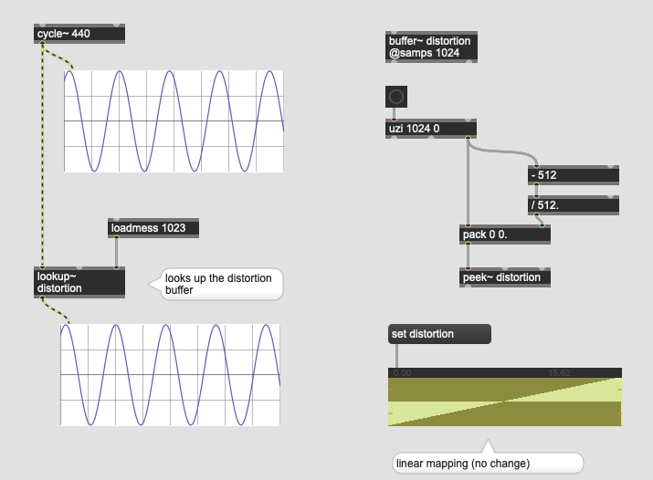
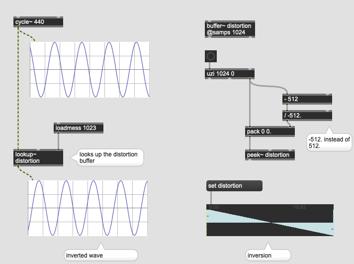
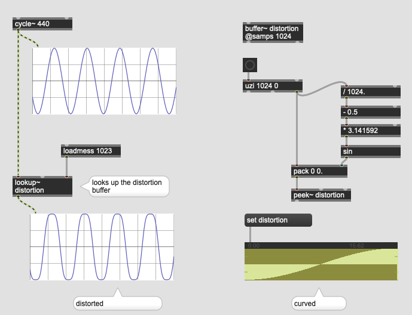
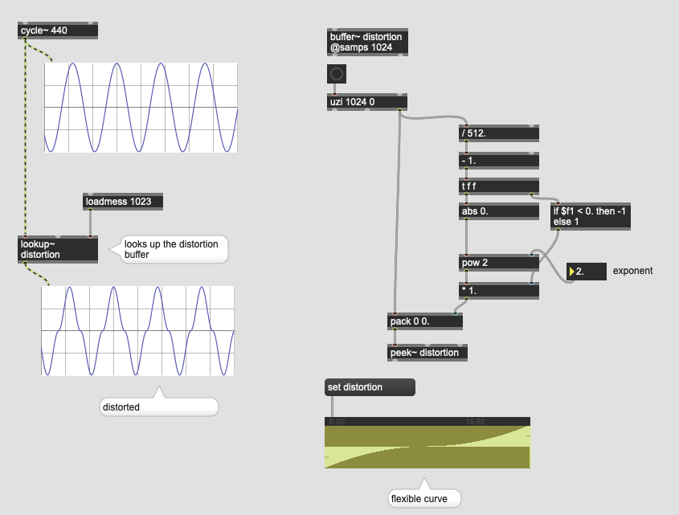

# K2: Distortion

### Assignment 1

Download the guitar sample below and play it back using buffer~ and play~ in Max.

[Guitar sample](K2/guitar.wav.zip)

---
## Simple Distortion with clip~

---

### Assignment 2

Apply distortion effect to the guitar sample using clip~.

---
## Overdrive~  (Soft clip distortion)

compared to hard clip, soft clip distortion contains less high frequency components; sounds darker.

## Anatomy of soft clip distortion

[Audio Hack](https://www.hackaudio.com/digital-signal-processing/distortion-effects/soft-clipping/)

### Assignment 3
Read the article and try implementing soft clipping distortion without using overdrive~.

## Creative distortion

## Distortion using lookup table (Waveshaping)

### lookup

### Assignment 4

Create two buffer~s and store two different lookup tables in them. Interpolate those two lookup tables using a slider and change the property of distortion gradually.

### Assignment 5

Distortion makes very rich sound in spectrum and masks other sound (Distortion guitar often masks the vocal sound). How can you avoid this in case you want to use distorted sound and other sounds at the same time?

