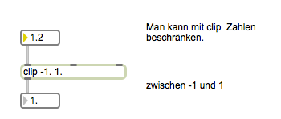
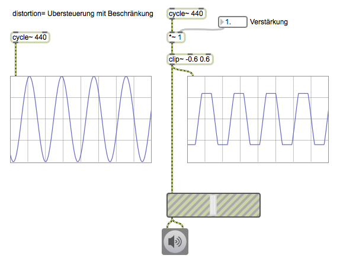
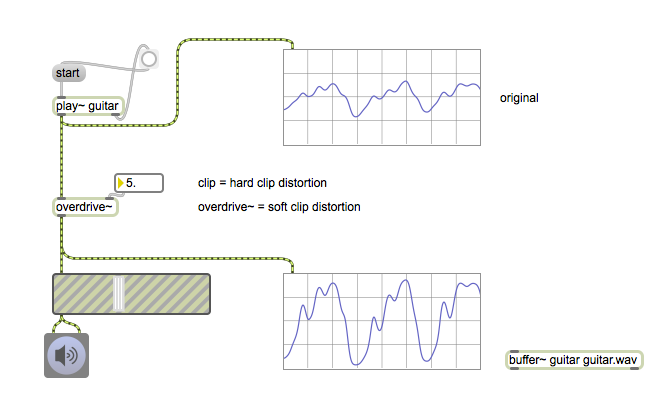
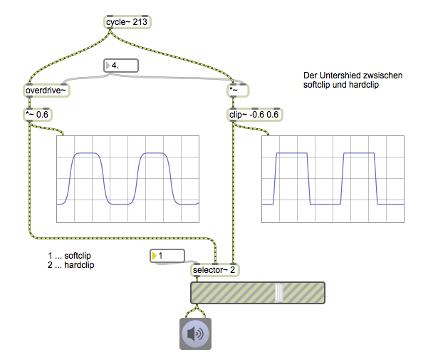
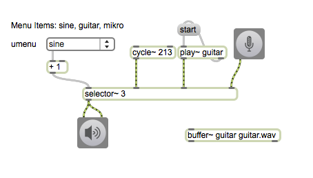
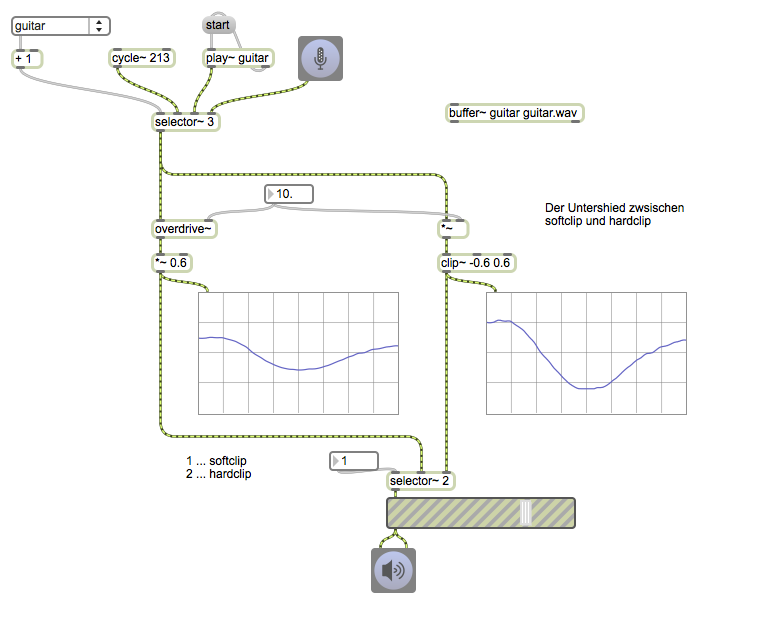
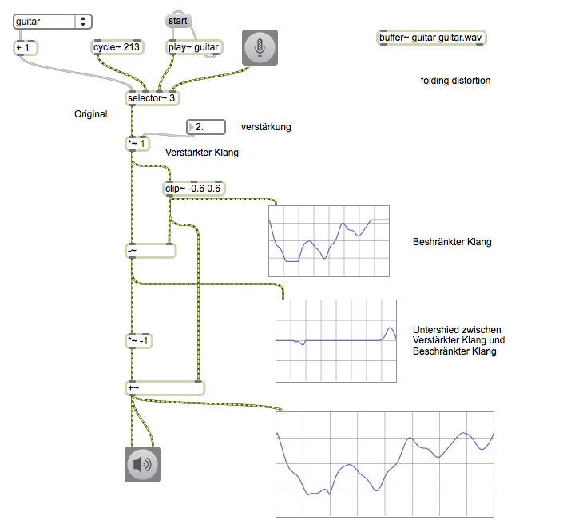
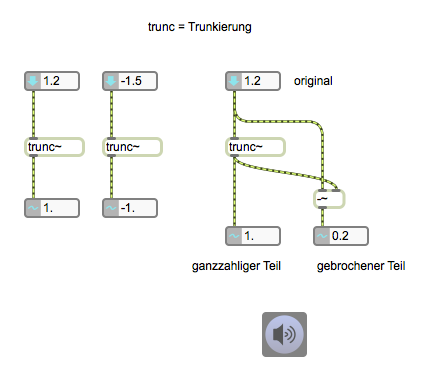
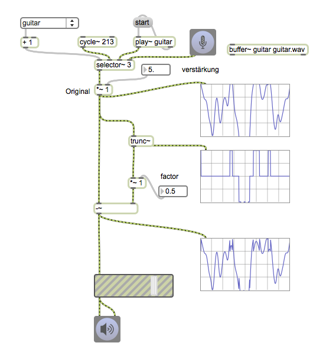

# K2: Distortion

### Assignment 1

Download the guitar sample below and play it back using buffer~ and play~ in Max.

[Guitar sample](K2/guitar.wav.zip)

---
## Simple Distortion with clip~

---

### Assignment 2

Apply distortion effect to the guitar sample using clip~.

---
## Overdrive  (Soft clip distortion)

---

---

### 

---

## Folding distortion

---

---

