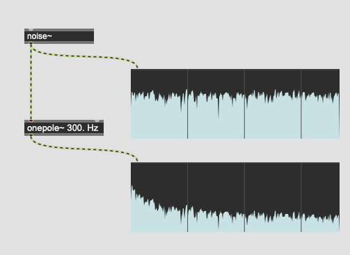
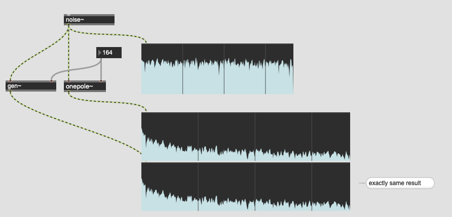
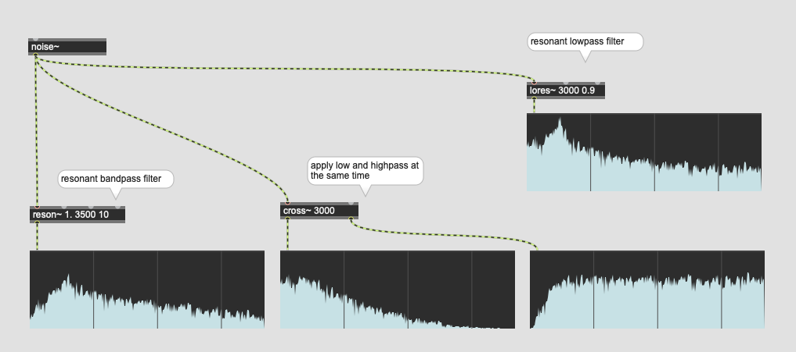
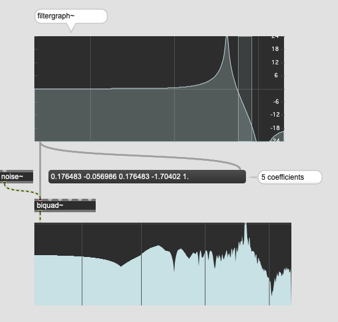
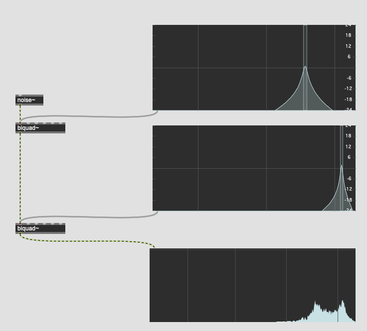
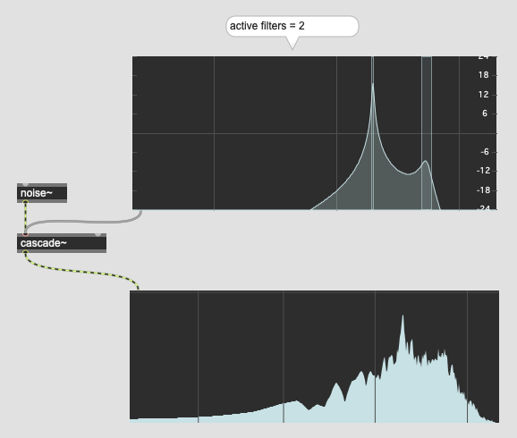
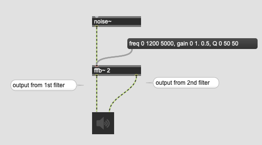
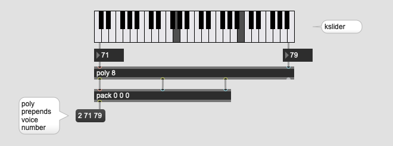

# K3: Filter (1)

## The true of digital DSP

Almost everything in time domain DSP is **delay**.
- delay
- reverb
- chrous
- flanger

and
- filter

are basically delay + some additional manipulations.

## Two types of filter

When it comes to filter, we often hear the following term.

- IIR ... Infinite Impulse Response
- FIR ... Finite Impulse response

In a nutshell, IIR involves feedback delay, while FIR doesn't since feedback delay theoretically generates infinite repetition of input.

## One pole filter

One pole filter is the simplest IIR filter which applies the low pass filter to its input.

### The one-pole algorithm
In short, one-pole low-pass filter algorithm is expressed as follows.

> y[n] = k * y[n-1] + (1 - k) * x[n]

- y[n] is the **output** at time n
- x[n] is the **input** at time n
- y[n-1] is the previous **output**
- k is a coefficient that determines the cutoff frequency, given by a = e^(-2pifc/fs), where fc is the cutoff frequency and fs is the sample rate.

### Assignment 1
Implement onepole filter in gen~ by yourself and produce exact the same result as the onepole~.

Hint:
- "e" ... outputs constant of napier, roughly  2.71828.
- "history" ... generates one sample delay
- "twopi" ... outputs the constant of 2PI
- "samplerate" ... outputs the constant of SR

### Assignment 2
Change the algorithm to 

> y[n] = k * x[n] + (1 - k) * y[n-1]

in order to change the filter to high-pass.

### Important things to take-away from this

All filters are basically delays with amplitude control. If you can read the equation, you can implement it in Max, using gen~, and it's possible if you are not a mathematician.

## Other filters in Max

resonant filters provide the Q (quality) factor parameter. By changing the parameter, you can change the steepness of the frequency response curve.

## The wah-wah effect

The Wah-wah effect which is used very often in the funk music can be implemented by rapidly changing the cutoff frequency of the resonant bandpass or lowpass filter.

### Assignment 3

Download the [guitar sample](K3/guitar.wav) and load it on your patch. Using lores~, implement the wah-wah effect apply it to the guitar sound. The result should sound like [this](K3/wahwah.wav)

Hint: cycle~ helps you to create the fluctuation of the cutoff frequency.

### Assignment 4
Control the speed of wahwah by the loudness of the input signal by modifying the previous patch.

hint: average~

## biquad~ and filtergraph~

**biquad filter** is a versatile IIR filter 
that can be expressed by the following equation

> y[n] = a0 * x[n] + a1 * x[n-1] + a2 * x[n-2] - b1 * y[n-1] - b2 * y[n-2]

It's complex but as you can see, this is the combination of multiple delays and amplitude modification.

By giving 5 coefficients a0, a1, b2, b1, and b2, biquad filter becomes lowpass, higpass, bandpass, resonant, bandstop, peak/notch, lowshelf and highshelf.

Those 5 coefficients are not easy to understand for average human ut filtergraph~ object let us generate them with an intuitive GUI.

#### controlling filtergraph~ from the outside
filtergraph~ allows us to use gain, cutoff, Q parameter and convert them to 5 coefficients.

#### More than one filter
filters can be used in sequence.

### Cascade Filter

"cascade~" object takes 5*n coefficients and apply multiple biquad filters to input signal at once.

### Assignment 5

Download the [aiff file](K3/threesines.aiff) that contains the recording of three sine waves (274, 744, 1000 Hz). Using cascade~ filter, eliminate 274 and 1000 Hz. sine waves from the recording.

## Filterbank

"fffb~" =  fast fixed filter bank object implements N reson~-like objects in it that allows you to control frequency, gain, and Q independently.

The object accept messages such as freq, gain, or Q followed by the target filter (in the patch 0 = fast filter). 

### Assignment 6: polyphonic subtractive synth
By applying a very high Q to the resonant band pass filter, we can perceive a pitch clearly. The synthesis technique that employs this phenomenon is called subtractive synthesis.

The goal of this assignment is to implement a subtractive synthesizer with the polyphonic capability. The synthesizer should produce max. 8 different pitches (voices) at the same time.

Study following objects in max and implement a polyphonic subtractive synthesizer

- kslider has a polyphonic mode and we can simulate the MIDI messages from a keyboard that accepts polyphonic input.
- poly object automatically distribute incoming MIDI message by prepending "voice number"
- mtof allows us to convert midi note number to frequency

