# K3: Filter

---
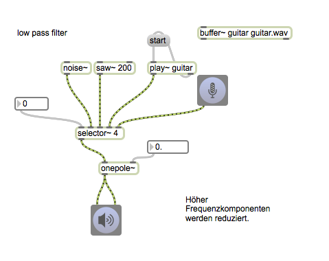
---

---

---

---
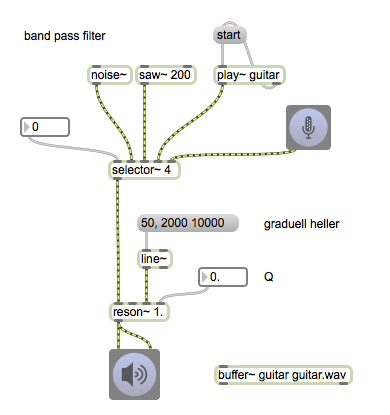
---

---

---

---

---
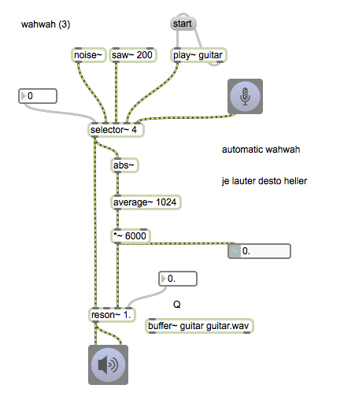
---
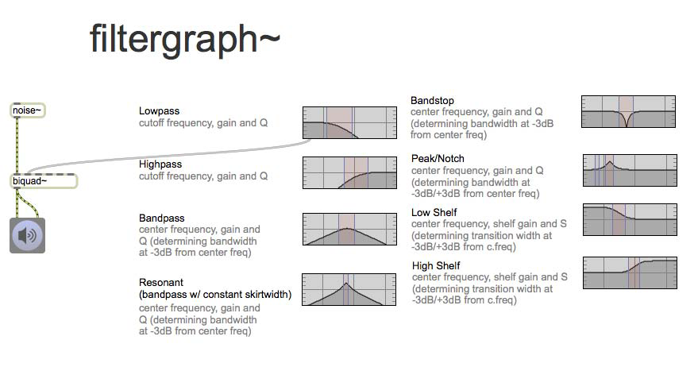
---
### Mehrere Filter

---

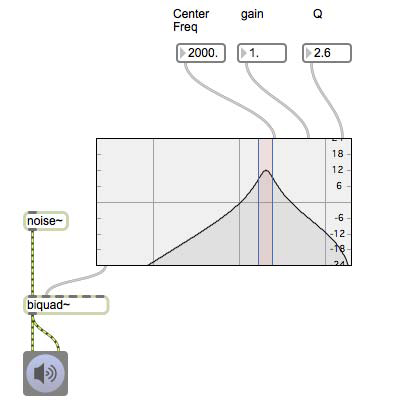
---
### Delay + Filter

---

### Cascade Filter

---
### Feedback + Filter
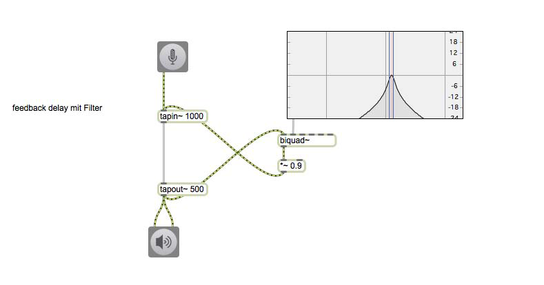
---

---
### Flanger + Filter
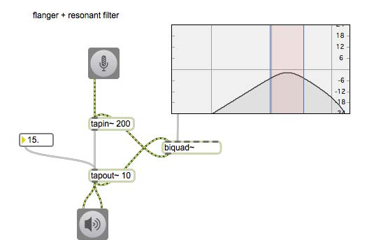
---
### Limiter

---
### Flanger + Limiter

---
### reverb
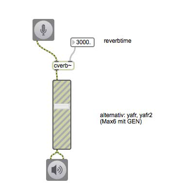
---

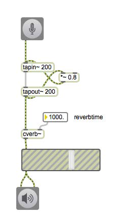
---
### Pannning
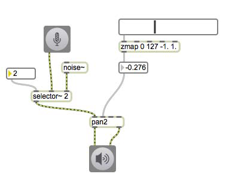
---
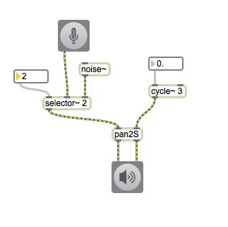
---
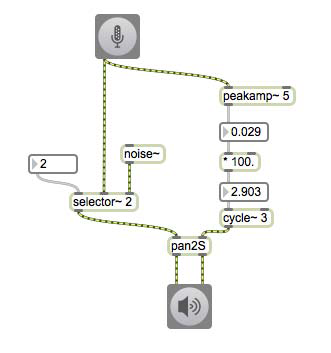
---
### Overdrive + Chorus
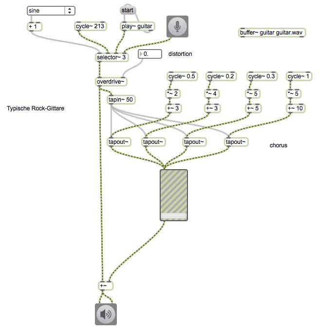
