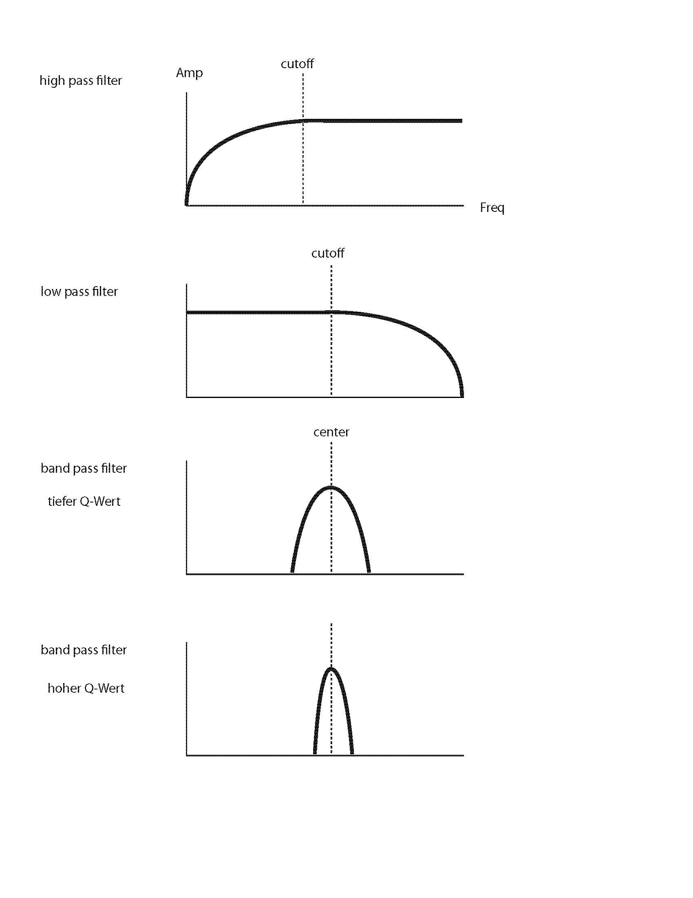
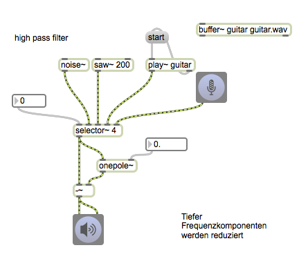
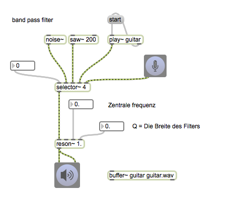

# K3: Filter (1)

## Basic Filters in Max

## Wahwah effect

### Assignment 1
Control the speed of wahwah by the loudness of the input signal by extending the patch above.

hint: average~

## Filtergraph~

### Mehrere Filter

#### controlling filtergraph~ from the outside 

### Feedback Delay + Filter

### Cascade Filter

