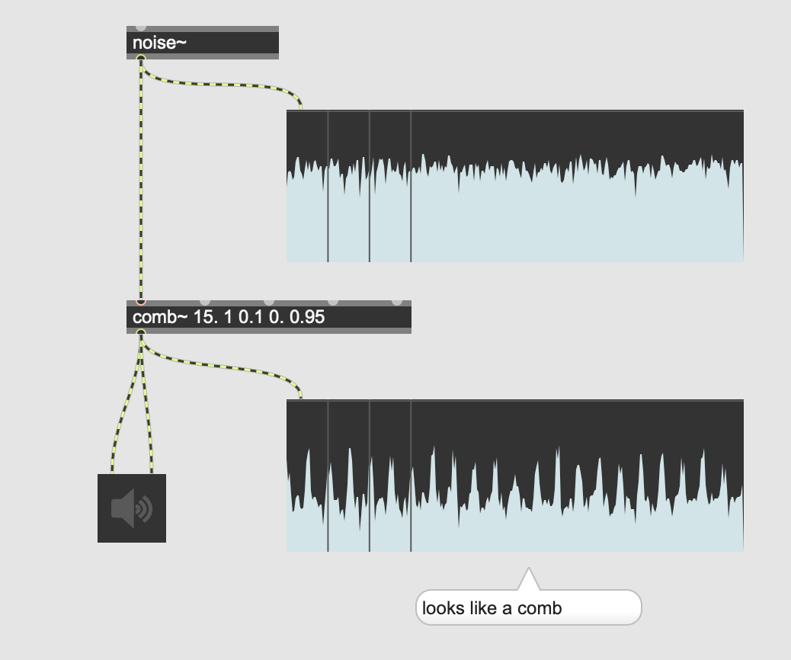
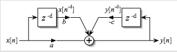
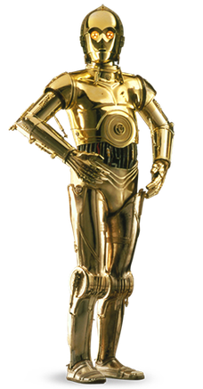
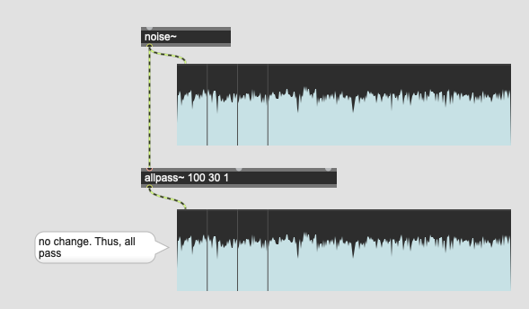
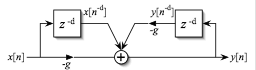
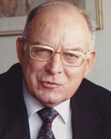
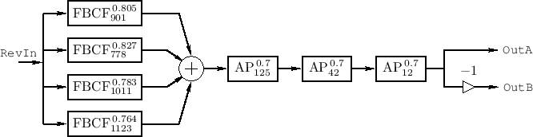

# K4: Filter (2)

## Comb Filter

### Why is it called comb?

 generates spectrum that could be realized by numerous resonant band pass filters distributed equally. 

### Isn't it just a feedback delay?

Comb filter has two types: feedforward and feedback, where feedback comb filter = feedback delay.

Max's combfilter algorithm combines both feedforward and feedback algorithm.

> y[n] = a * x[n] + b * x[n]-(SR * D/1000) + c * y[n]-(SR * D/1000)

where  
SR = sample rate  
D = deley time

Note: feedforward is FIR (Finite Impulse Response), feedback is IIR (Infinite Impulse Response).

### Assignment 1: Feedback delay

Download the speech sample from [here](K4/spoken.wav) and load it onto your new patch.

With a comb~ object apply feedback delay effect to the speech where delay time is 100 ms and the feedback ratio = 0.9.

### Assignment 2: C3PO effect

Use the comb~, simulate the robotic voice sound of C3PO, using the recorded sample download in the previous assignment. The pitch of the voice should be controllable by a kslider.

## Allpass Filter

Allpass filter delays signal and potentially creates a feedback loop.
However,  allpass filter doesn't change the frequency component of the input.

### Why is it useful?

If comb filter is used with higher feedback ratio and shorter delay time, it generates "robotic" pitched sound.
In case this effect is not desired but the feedback with shorter delay time and higher feedback is required, allpass filter is useful.

### Assignment 3 : comb~ vs allpass~
Compare the sound from comb~ and allpass~ where the delaytime is 50 and the feedback ratio is higher than 0.9.

### Why is it possible?

Here is the algorithm of allpass filter.
It is very similar to comb filter.
The most important difference is the gain factor g is negated (-g).

This means, the feedback delay signal added to the input signal is inverted in phase. With this manipulation, the repetition of the signal is largely reduced in the output signal.

### Assignment 4 : The power of negation

Download the [vocal sample](K4/voice.wav) and load it onto your new patch.

Use tapin~ and tapout~, apply the feedback delay where the delay time is 5 msec, the feedback ratio is 0.8.

Hear the robotic, pitched artefact from the feedback then change 0.8 to -0.8.

## Reverb and comb and allpass filter

The most primitive algorithmic reverb consists of multiple comb and allpass filters where comb filter simulates the early reflection and allpass simulates the reverb tail.

### Assignment 5

Manfred Schroeder established the basic model of digital reverb using multiple comb filters and allpass filters. 

Here is the diagram of his reverb, implement this in your patch.

where 

FBCF = Feedback Comb filter  
Two numbers next to them represent
feedback ratio and delay time

AP = allpass
two numbers next to them represent
feedbarck ration and delay time

