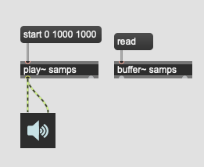
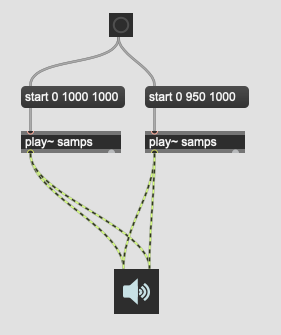
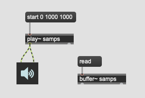
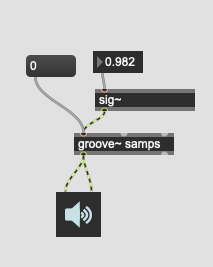
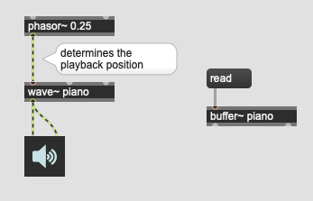
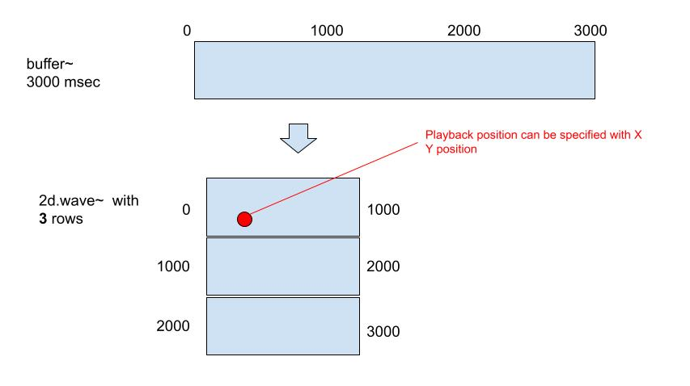

# K5: Sample manipulation

Download [Piano sample](K5/piano.aif).

## Playback

One of the fundamental problems/characteristics of sample playback is the played sound is always the same. Thus, this sounds unnatural (this isn't necessarily bad thing, but we need to be aware of it). There would be many ways to avoid this "always the same" problem. 

## Multiple playback 
It is possible that two instances of play~ refer to the same buffer~ and playback simultaneously but with slightly different parameters.

Note: you can use also mc to implement this.

### Assignment 1: Pitch Deviation

Add three more instances of play~ to the patch and play the same sample with 5 instances simultaneously but with slightly different pitch. The pitch should be randomized programatically.

Deviate the pitch of each playback randomly. This creates chrous-like effect.

### Assignment 2: Time Deviation

The patch for assignment 1 starts the playback at the same time. Randomize the timing slightly
programatically.

Hint: delay object accepts integer.

### Assignment 3 (optional)
We can deviate more parameter such as pan position, amplitude, cut off of lowpass etc in order to vary the sonority even further.

## Additive playback
Multiple samples can be played back twice of three times faster than the original. In terms of pitch this creates overtone series.

### Assignment 4
Load the piano sample and play it with 5 instances of play~ simultaneously.
The first instance play it back with the original speed, the second instance plays it twice as fast as the original, the third instance play three times faster etc.

### Assignment 5
Apply 5 different envelopes to each playback instance of the previous patch.

## Playback with a varying speed

Once playback is started, it would be not easy to change the playback speed. For example, in case start message is sent to play~.

### Assignment 6
Make the playback speed possible to change after the playback is begun using e.g. groove~ object and let the user control/automate the pitch transition during the playback using function object.

## 2D playback with 2d.wave~

### wave~
similar to play~ but unlike play~ it accepts phase value between 0 and 1 to determine the playback position (play~ requires msec)

### the concept of 2d.wave~

2d.wave~ is similar to wave~ object but with additional axis. A given sample will be divided into n rows and Y phase will determine which row will be used. If Y phase points the between two rows, both rows can be heard with cross -fading.

### Assignment 7: proof of concept

In order to prove the concept of 2d.wave~ 
1. allocate a buffer for 3000 msec of sample
2. fill the buffer with sawtooth sound with three different pitchs
   1. 0...1000 ms.      -> 100 Hz.
   2. 1000...2000 ms.   -> 500 Hz.
   3. 2000...3000 ms.   -> 1200 Hz.
3. create 2d.wave~ and refer to the buffer from it
4. apply a signal from "phasor~ 1" to the X axis input
5. Send audio signal of 0, 0.333, and 0.666 to the Y inlet to confirm the functionality
6. replace the fixed signal to the Y inlet with variable one (such as phasor~ 0.05)

### Assignment 8
Using rand~ make the transition between each row by the Y parameter more unpredictable.

