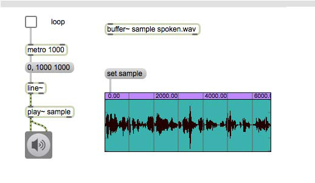
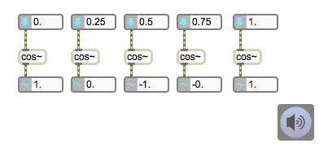
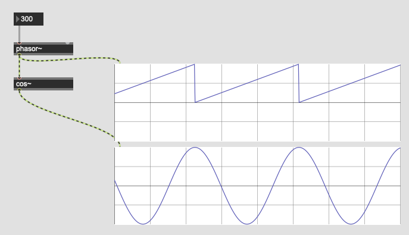
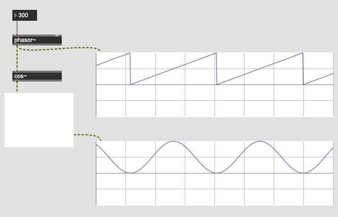
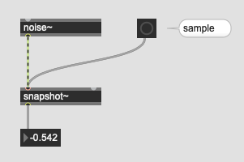
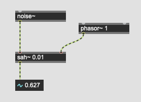
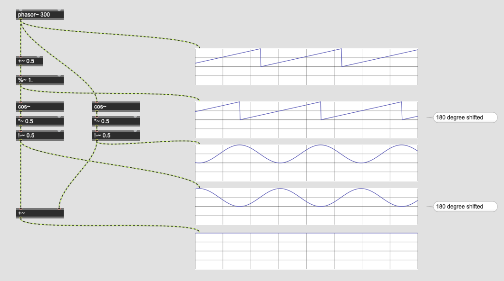
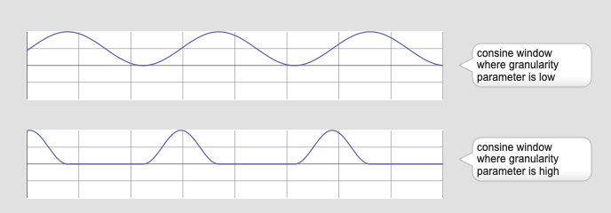

# K6: Granular sampling

## Loop in max

Here is one way of looping a sample in buffer~

### Assignment1 : phasor~-based loop

"phasor~" is an object that produces audio signal between 0 and 1 with a specified speed in Hz.

Modify the patch above by replacing line~ and metro with a phasor~. In this way, we can process more in audio domain. Thus, the timing becomes more accurate.

### Grain
"Grain" in the granular sampling means a small snippet of the sample that last usually max. 100 ms.

### Assignment 2 : Grain playback

Change the patch for the assignment 1 as follows:

- playback only a small snippet of the entire buffer~
- The snippet last 50 msec
- The snippet start at 1000 msec point in the buffer~ and ends at 1050 msec point
- The playback of the snippet should not change the pitch of the playback. Thus, the snippet is played back 20 times per second.

### Assignment 3 : Offset
In the previous assignment the portion (= grain or snippet) in the buffer~ to be played back is fixed; between 1000 and 1050. 

Add one more number box to the patch and enable the user to control the start point (offset time) of the playback

## The click noise problem
Since granular sampling plays back an arbitrary fragment (=grain) of buffer~. It produces the discontinuity of audio signal between at the end of fragment and at the begging of the fragment. This causes an audible artefacts called click noise.

### Window function
The general solution to this click problem is windowing. Windowing means to apply fade-in and fade-out to each grain. In this way, we forcibly make the beginning and the end of grain silence in order to avoid the click noise by creating continuity by the silence.

### Cosine function

There are many [window functions](https://en.wikipedia.org/wiki/Window_function). Each window function produces slightly different audible result.

For this seminar, we use cosine function for the simplicity. In Max, there is cos~ object that implements this function.

As the screenshot below shows, we can provide the object with phase value (0-1) and obtain cosine of the input phase from its outlet.

### Assignment 4: cosine window scaling

by connecting phasor~ to cos~, we can create a cosine wave that synced with phasor~.

However, this cannot be used directly as the window function because 

1. the cosine wave is bipolar, it should be unipolar
2. It starts with 1 and ends with 1 because of the nature of the cosine wave. However, we want the signal that start with 0 and end with 0.

Process the output of cos~ and create a signal that fulfils the following criteria.

1. unipolar signal
2. start with 0 end with 0, yielding 1 in the middle.

The processed signal should look like this.

### Assignment 5: Anti-click granular
By applying cosine window technique (assignment 4) to the patch of granular (assignment 3). Solve the click noise problem.

## Realtime parameter change

With the cosine window technique, we can avoid the click noise, but we still hear the clicks when we change the offset parameter.

The cause of this problem is obvious, we change the offset during the playback of the grain. Thus, it creates the discontinuity in the signal.

### Sample and hold
**Sample and hold** or **sah** is the general solution for this problem. 

To understand the concept of sah, consider the following patch.

In the patch, noise~ generates random float number continuously, and when the user press the "sample", an audio sample from noise~ is **sampled** and this number is **held** in the number box below.

**sah~** allows you to do this in the audio domain.

At the moment the control signal, that is connected to the right inlet of sah~, exceeds the threshold given as the argument (0.01). sah~ samples an audio signal from the left inlet and hold that value or keep outputting the held value.

This helps to solve the realtime parameter change problem because we can update the number at a convenient moment.

In granular sampling, the convenient moment to change the parameter is the **beginning** or the **end** of grain since it is silent because of the **windowing**.

### Assignment 6: Click-free offset change

By using sah~ object, solve the click noise problem caused in the patch for assignment 5.

## The tremolo sound problem

Windowing solves the problem of click noise, but it produces audible artefacts; tremolo effect due to its rapid amplitude change.

By applying OLA (overlap and add) technique, we can avoid tremolo effect and produce more continuous sound.

### OLA
In OLA (Overlap and Add), we use two (or more) modules that synced with the same phasor~ but one of the windowing function received the phase value that is 180 degree shifted. This generates an inverted windowing function.

By adding those two functions or the audio signal processed by those two functions, we can restore the amplitude of the original.

### Assignment 7: The complete granular sampling 

Apply the OLA technique to the patch for assignment 6 and solve the problem of tremolo effect.

### Assignment 8: Pitch shift
Currently, the size of the grain is fixed to 50 ms but by varying the grain size without changing the duration of the playback, we can change the playback speed.

- Add a number box to control the pitch 
- No click noise should be produced when the pitch is changed

### Assignment 9: Well-tempared pitch shift (optional)
Would it be possible to change the pitch using the well-tempered scale? e.g. would it be possible to generate major third higher pitch than the original pitch intentionally?

### Assignment 10: Offset randomization
Add a number box to the patch and enable the users to control offset randomization range parameter. According to the parameter, the offset of each grain is randomized without generating click noise.

### Assignment 11: Granularity (Duty Cycle)
Currently, the cosine window fills the entire grain. However, it is possible to make the window shorter than the grain and fill the remaining with silence. This would create staccato-like effect.

Add a number box to the patch and enable the user to control the granularity of the grain.

