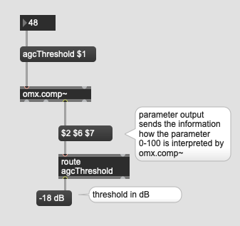

# K7: Dynamic control

Limiter, Compressor, Gate, Expander, or Ducker
are commonly used dynamic control processor. They check the level of the incoming signal frequently and adjust the volume automatically in different ways.

## omx objects
omx = OctiMax objects, max's built-in objects for dynamic control. It was developed by octiv inc (the company is closed) so the messaging etc. to that objects are not very consistent with other objects. However, it is still the best option to use those objects in terms of dynamic control.

## Limiter
helps you to reduce the volume when the input is too hot.

### When to use
In live-electronics, limiter can be used as a **safety net**. When the flutist hits a microphone with the instrument accidentally, the limiter at least reduce the volume of that unexpected input.

### Assignment 1
Load the sample of [drumloop](K7/drumloop.wav) on to your patch.

In the drumloop sample, the snare drum is the loudest sound. Use the omx.peaklim~ and reduce the level of the snare drum.

Hint: omx.peaklim~ accepts "threshold" message followed by integer between 0 and 100. 0 mean -24 dB, 100 means 24 dB. The sound over this threshold will be attenuated.

### Assignment 2
Visualize how the limiter reduces the volume of incoming signal

Hint: by sending "meters 1" message, omx.peaklim~ start outputting meter messages.

## Compressor
compressor compresses the dynamic range by attenuating the loud sound (Downward compression) or boosting the soft sound (Upward compression).

omx.comp~ offers both downward compression and upward compression.

### When to use

For example, the dynamic range of classical guitar is by its nature very wide. The loud sound could be very loud (Rasqueado) but the soft sound could be very soft (single note) that can be disturbing when you mix it with other instruments.
Compressor helps you to avoid extremely soft and loud sound and make everything "mezzo forte".

### agcThreshold

agcThreshold is the most important message for omx.comp~. This determines the target level and every sound louder than this will be attenuated toward this level, and every sound softer than this will be boosted.

### Assignment 3
As the screenshot above, set the agcThreshold to 48 (-18 dB) and send white noise below and above -18 dB to verify the functionality of omx.comp~.

Hint: dbtoa object helps to convert dB to amplitude.

### Assignment 4
Replace the noise input with drumloop and change the agcThreshold parameter and describe how the threshold value influence the processed result.

### Ratio parameter
Ratio determines how much the sound below/above the threshold is amplified/attenuated towards the threshold.

- ratio = 100 ... the level is adjusted to the threshold  
- ratio = 0 ... the original level

### Assignment 5
In the patch of Assignment 4, set the agcThreshold at its maximum and change ratio between 0 and 100.

Then, set the agcThreshold at its minimum and the change the ratio between 0 and 100.

## Noise Gate
omx.comp~ offers one more function, namely noise gate. If the incoming signal level is below the noise gate threshold, the incoming signal is **attenuated** further. In this way, we can remove e.g. background noise.

### Assignment 6
Apply noise gate to the drumloop sample in order to reduce the background noise. There are three important parameters to achieve this.

- agcEnabled ... on/off the compressor. 1=on 0=off. It would be helpful to evaluate noise gate when the compressor is turned off 
- ngEnable ... on/off the noise gate. 1=on 0=off.
- ngThreshold ... below this level, the noise gate is applied.

