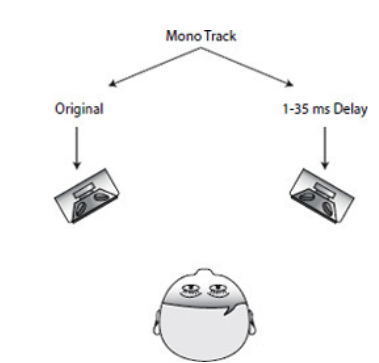
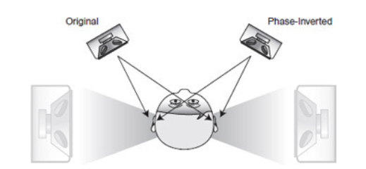
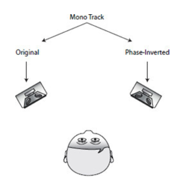

## K8: Stereo effect

## Haas Trick

Haas trick is a very simple technique that makes mono track very wide stereo sound by applying a slight delay (1-35 ms) to one channel.

### Assignment 1
Load the [guitar sample](K8/guitar.wav) onto your patch and program the Haas trick.

### Assignment 2
Haas trick further suggests applying boost upto 10dB to the ghost copy to produce rather unnatural yet interesting stereo image. Implement this parameter in the patch for assignment 1.

## Out of Speaker trick

Out of speaker trick creates an unnatural stereo image as if the speakers are not in front of the listener.

To implement this, the mono track is sent directly to the left speaker but sent to the right speaker with its phase inverted.

### Assignment 3
Implement out of speaker trick in max using the guitar sample.

## Panning

By sending the mono track to both left and right speaker by applying different gain. We can create the illusion of position in the stereo field. This is called panning.

In Max, we can achieve panning effect by using pan2 or pan2S abstraction, where pan2S accepts control using audio signal.

### Assignment 4: Panning
Use pan2 or pan2S move the guitar sample from left to right gradually by a slider or automate the movement with line/line~.

### Assignment 5: Auto panner
The movement of panning can be programmed.
Use cycle~ and pan2S move the guitar sound automatically between hard-left and hard-right.
The speed of movement should be also controllable.

### Spectral Spatialization
By applying filters, we can extract specific frequency component of the incoming signal (e.g. low portion of the sound, high portion of the sound etc.). The idea of spectral spatialization is to put those portion of original sound in difference positions. 

### Assignment 6: Simple Spectral Spatialization
Use cross~ filter extract higher and lower frequency components of the guitar sound and place it at the hard-left and hard-right.

### Assignment 7: Combination (optional)
Instead of hard-left and hard-right, use pan2S and ake each filtered sound movable and apply auto panner of different speed for each filtered sound.

## Wider
The width of stereo image can be control to some extent by SM/MS conversion technique.

