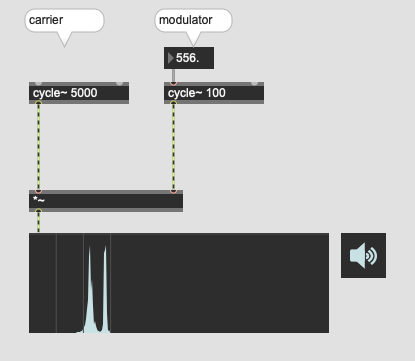

# K9: Other techniques

## Bitcrushing

The quality of Digital Audio is determined by two parameters

1. sample rate (44.1k, 48k, 96k etc)
2. bit depth (16, 24, 32 bit)

Those two parameters represent the resolution of X and Y of the digital audio wave respectively.

In Max, the audio samples are expressed with float numbers using 24bits. However, we can intentionally reduce this resolution, and it is called bit-crushing.

### Assignment 1

Play a 440 Hz sine wave, plot it using plot~.
Reduce the bit depth to very low number and plot it again.

Hint: degrade~ is the object for controlling bit-depth.

Then, listen to the degraded sine wave.

### Assignment 2
Download the [voice sample](K9/spoken.wav) and apply bit-crushing.

## Ring modulation

Ring modulation is a technique to produce a pair of sideband by multiplying sine wave coming from modulator to the carrier.

Instead of carrier oscillator, we can use samples or audio input as carrier.

### Assignment 3
Use the voice sample as carrier and listen to the sound.

### Assignment 4
Use multiple modulator against one carrier, control the amplitude of each modulator independently and observe how the amplitude of each modulator influence the produced sound.

### Assignment 5 (optional)
Use AM instead of RM and observe the difference.

